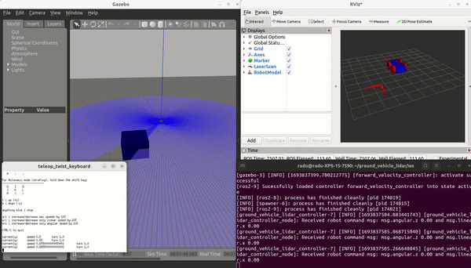

# four_ws_vehicle

Simulation of a 4 wheels vehicle with a 2d lidar in ROS2 and Gazebo.

## Prerequisites
Developed and tested in an Ubuntu 22.04 and ROS2 Humble environment.
- Install [ros2-humble](https://docs.ros.org/en/humble/Installation.html).
- `sudo apt install ros-humble-ros2-control`
- `sudo apt install ros-humble-ros2-controllers`
- `sudo apt install gazebo`
- `sudo apt install ros-humble-gazebo-ros-pkgs`
- `sudo apt install ros-humble-gazebo-ros2-control`
- `sudo apt-get install ros-humble-controller-manager`
- `sudo apt-get install ros-humble-teleop-twist-keyboard`
- `sudo apt install ros-humble-joint-state-publisher`
- `sudo apt install xterm`

## Bugs
Change urdf path to your own path file in wheeled_robot.urdf
- `<parameters>/home/radu/four_ws_vehicle/ws/install/four_ws_vehicle_simulation/share/four_ws_vehicle_simulation/models/config/controllers.yaml</parameters>`

## Run instructions
- `cd four_ws_vehicle/ws`
- `colcon build`
- `source /opt/ros/humble/setup.bash`
- `source ~/four_ws_vehicle/ws/install/setup.bash`
- Run the launch file.
	- `ros2 launch four_ws_vehicle_simulation four_ws_vehicle_simulation.launch.py`